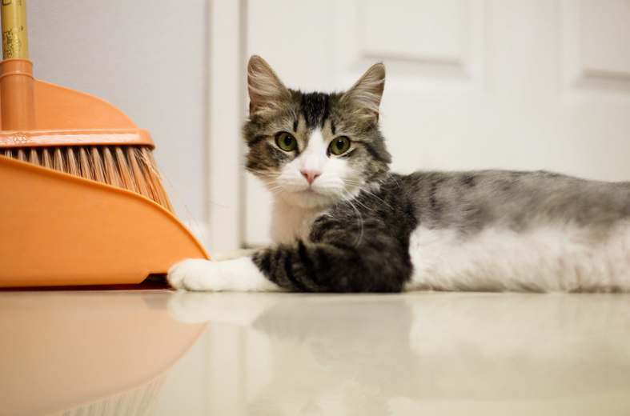

# Вместо эпилога

Полагаю, после всех пережитых приключений логичным следующим этапом должно быть прикручивание какого-нибудь ChatGPT или аналогичной сетки к документации. А то что, у нас зря что ли отдел машинного обучения сидит, ~~ерундой~~ важными проектами занимается?
Уже есть интересные плагины для редактора ObsidianMD, которые делают неплохие summary - для научных отчетов и обзоров литературы просто огонь. Также есть немало задач, где требуется набросать несложную инструкцию по официальной документации (например, docker, linux и т.д.). 

Как вы поняли, конечная цель, чтобы документация писалась сама, я потеряла работу и ушла работать дворником (рисунок [-@fig:cat]). Их вроде не собираются автоматизировать, здесь пока люди дешевле технологий )

{#fig:cat}
