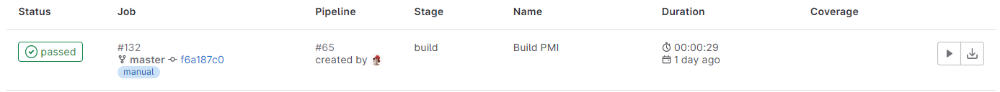
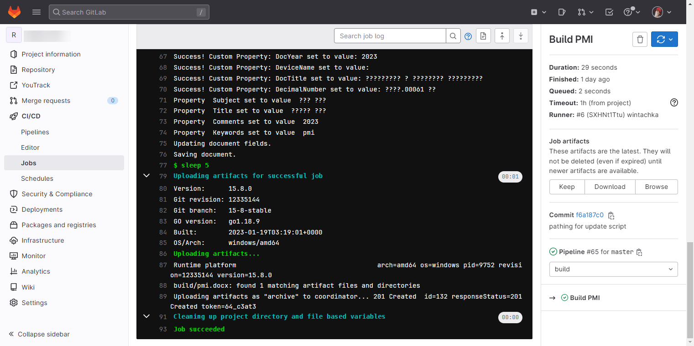

Итак, наконец-то я добралась до уровня с боссом CI/CD. Пришлось просмотреть немало всяких прохождений, но я справилась). Теперь в репозитории проекта любой менеджер или разработчик может собрать себе docx и скачать артефакты. И теперь техпису не нужно таскать с собой в отпуск ноутбук!

Gitlab'овский CI/CD состоит из двух важных компонентов и двух конфигов:

- gitlab-runner нужно установить на машину с Windows, на которой будет выполнена сборка. Эта служба выполняет все нужные команды для сборки нашего проекта;
- в проекте на сайте Gitlab должна быть включена функция CI/CD;
- в корне проекта должен существовать файл `.gitlab-ci.yml` с описанием порядка сборки (команды). Все это будет передано gitlab-runner'у на исполнение;
- рядом с исполняемым файлом gitlab-runner должен лежать конфиг `config.toml`, в котором описаны настройки подключения к Gitlab.

Все нижеописанные непотребства я проделывала на selfhosted Gitlab/Gitlab runner версии 15.8, Windows 10, Microsoft Word 2021. Предполагается, что у вас есть права владельца проекта на Gitlab'е.

Кроме того, на машине, которую будете использовать для сборки, должен быть установлен весь набор программ: Git, pandoc/pandoc-crossref, Microsoft Word, шрифты. 
Рекомендую также поставить расширение [Gitlab Workflow](https://marketplace.visualstudio.com/items?itemName=GitLab.gitlab-workflow) для VSCode для валидации конфигов и запуска пайплайнов прямо из VSCode.

# Установка и настройка gitlab-runner

В официальной документации присутствует [туториал](https://docs.gitlab.com/runner/install/windows.html) по установке и настройке gitlab-runner, однако прямо скажу, не очень он отражает суровую действительность и количество проблем, с которыми пришлось столкнуться.

1. Для начала активируем для проекта CI/СD (_Settings_ -> _General_ -> _Visibility, project features, permissions_ -> _Expand_ -> включить CI/CD).
2. В разделе _Setting_ -> _CI/CD_ -> _Runners (Expand)_ есть информация, которую нужно указывать при регистрации gitlab-runner ниже (token и адрес). Если у вас selfhosted Gitlab на докерах, то адрес может быть с HTTP, даже если у вас HTTPS. Если при регистрации gitlab-runner появляется ошибка 401, то вам нужен HTTPS.
3. Делаем по туториалу [Install Gitlab Runner on Windows](https://docs.gitlab.com/runner/install/windows.html), ну по крайней мере первые пункты совпадают ). На машине создаем папку без кириллицы (`D:\gitlab-runner`). На каждый проект нужен свой раннер.
4. Сохранить туда .exe, ([вот файл](https://gitlab-runner-downloads.s3.amazonaws.com/latest/binaries/gitlab-runner-windows-amd64.exe)). Переименовать exe в `gitlab-runner.exe` (для удобства, можно как угодно назвать).
5. Если у вас self-signed сертификат в Gitlab'e, экспортируйте его с сайта и положите в рабочую папку раннером (например, файл `gitlab.blabla.ru.crt`).
6. Запустить от администратора консоль (обычную, не PowerShell) и перейти в папку с раннером (`d:`, `cd D:\D:\gitlab-runner`).
7. Выполнить в консоли следующую команду.  В `TOKEN` надо указать токен проекта со страницы _Setting_ -> _CI/CD_ -> _Runners (Expand)_, а в `tls-ca-file` -- **абсолютный путь** к сертификату. В `executor` можно указать несколько оболочек (https://docs.gitlab.com/runner/executors/), мне нужен только shell:
   
   ```text
    gitlab-runner register --non-interactive --registration-token TOKEN --url https://gitlab.blabla.ru/ --tls-ca-file D:\gitlab-runner\gitlab.blabla.ru.crt --executor shell
   ```

8. Раннер будет зарегистрирован и появится на странице _Setting_ -> _CI/CD_ -> _Runners (Expand)_.
9. Открыть конфигурационный файл `config.toml` (появится рядом с exe раннера после регистрации) и поменять `pwsh` в ключе `shell` на `powershell` (иначе при запуске пайплайна будет ошибка, что путь не найден).
10. Установить службу командой `gitlab-runner.exe install` и запустить `gitlab-runner.exe start`. Если вы измените конфиг `config.toml`, то службу нужно перезапустить.
11. После этого на странице _Setting_ -> _CI/CD_ -> _Runners_ раннер должен стать зелененьким. Если не стал, значит что-то не так, и джобы не запустятся.
12. В "Службах" в Windows перейти в свойства службы gitlab-runner -> _Вход в систему_ > _галка "Разрешить взаимодействие с рабочим столом"_.

В общем все готово, и можно выполнить тестовую джобу из [туториала](https://docs.gitlab.com/ee/ci/quick_start/). Для этого нужно скопировать содержимое тестового примера в файл `.gitlab-ci.yml` в корне проекта и закоммитить. В данном случае джоба будет запущена автоматически, сразу после коммита, и появится на в разделе _CI/CD_ -> _Jobs_. В консоли будут выведены команды `echo`.

Что делает джоба? Выкачивает с помощью Git наш проект из репозитория и применяет перечисленный в `.gitlab-ci.yml` команды. Артефакты, которые получились в результате, пакует и передает Gitlab'у. Артефакты можно скачать в результатах работы или с вкладки Release (если она была настроена).

Ошибки раннера можно смотреть в Windows в Просмотре Событий или в PowerShell `Get-WinEvent -ProviderName gitlab-runner`.

# Исправляем ошибки и фиксим конфиги

Как вы понимаете, если бы все было так просто, мы бы тут не собирались.
Первая проблема, с которой я столкнулась -- кракозябры в консоли на GitLab. Потом отказывался запускаться скрипт. Потом скрипт не мог найти нужные пути. Короче, без долгих прелюдий перехожу сразу к списку фиксов возможных проблем.

## Кракозябры в консоли на GitLab

Чтобы gitlab-runner не писал кракозябры в скрипт `.gitlab-ci.yml` в конфиг работы нужно добавить `CHCP 65001`:

```yaml
build-job:
  before_script:
   - CHCP 65001
  stage: build
  script:
```

Это еще не все. На машине, на которой стоит gitlab-runner нужно переключить региональные настройки на _Английский (США)_: _Региональные параметры_ -> _Дополнительные параметры ... _ -> _Региональные стандарты - Изменение форматов даты, времени и чисел _ -> _Дополнительно_ -> _Изменить язык системы_ -> выбрать Английский (США).

Это тоже еще не все, так как при запуске скриптов `build.ps1` и `update_docx_props.ps1` могут возникнуть проблемы с кодировкой. Эти скрипты нужно открыть в блокноте Notepad++ и пересохранить в кодировку `UTF-8 BOM`. В демонстрационном репозитории все уже в правильной кодировке.

## Git, пути и директории

Если вы, как я, до этого никогда не имели дела с настройкой CI/CD (кроме как GitHub, который все сам делает), то можно зависнуть на очень простых ошибках.

Иногда, при скачивании с Git работа может упасть с ошибкой авторизации (**Authentication error**). Это происходит рандомно у разных людей. Чтобы исправить ошибку, нужно в конфигурационный файл gitlab-runner `config.toml` под параметром `url` добавить еще одну строку с параметром `clone_url`. URL указать точно такой же как в `url`. Магия, что сказать.

Чтобы запускать наши скрипты, нам полезно будет иметь фиксированные директории. По умолчанию gitlab-runner скачивает репозиторий в папку с названием из рандомного набора букв и цифр (например, `build/123hjksd898231`).
В конфиг  `config.toml` в раздел `[runners.custom_build_dir]` добавить строчку `enabled = true`.

Вот как примерно выглядит конфиг после всех фиксов:

```toml
concurrent = 1
check_interval = 0
shutdown_timeout = 0

[session_server]
  session_timeout = 1800

[[runners]]
  name = "docbuilder"
  url = "https://gitlab.blabla.ru/"
  clone_url = "https://gitlab.blabla.ru/"
  id = 6
  token = "SOMETOKEN"
  token_obtained_at = 2023-02-16T11:50:04Z
  token_expires_at = 0001-01-01T00:00:00Z
  tls-ca-file = "D:\\gitlab-runner\\gitlab.blabla.ru.crt"
  executor = "shell"
  shell = "powershell"
  [runners.custom_build_dir]
    enabled = true
  [runners.cache]
    MaxUploadedArchiveSize = 0
    [runners.cache.s3]
    [runners.cache.gcs]
    [runners.cache.azure]
```

Эта настройка позволит в конфигурации `.gitlab-ci.yml` задавать путь, куда будет склонирован проект:

```yaml
variables:
  GIT_CLONE_PATH: $CI_BUILDS_DIR/$CI_PROJECT_NAME
```

Код будет склонирован в папку `/build/[название проекта с Gitlab]`. Можно также указать вместо `$CI_PROJECT_NAME` любое имя.

Когда будете формировать шаги по сборке gostdown'ом очень рекомендую использовать команды перехода по директориям перед выполнением скриптов. 
Скрипты не будут выполнятся, если их путь начинается с переменной (`./$CI_BUILDS_DIR/test/build.ps1` будет ругаться на `You must provide a value expression following the '/' operator.`, `Unexpected token`, `Missing closing '}' in statement block or type definition` и все подряд). 

Кроме того, скрипт `build.ps1` необходимо запускать из директории документа, который вы собираете. В противном случае, pandoc сначала не найдет файлов, потом не найдет include, потом вообще обидится и упадет с ошибкой. Так что если что-то не собирается, и возникают непонятные ошибки, сначала проверьте все пути!

## Права, разрешения и доступ к COMObject

Если вы сразу после установки и успешного выполнения джобы из туториала попробуете запустить скрипт Gostdown, то ничего у вас не выйдет. Скрипт свалится вот на этой строчке: `$word = New-Object -ComObject Word.Application`.

Нет, у меня сначала все получилось, потому что я запускала все на своем ноутбуке для тестирования. 
Но при переносе пайплайна на отдельный сервер вылезли ошибки, связанные с правами запуска службы и разрешениями COMObject. 

Такая горемыка была не я одна, про это есть тред на [stackoverflow](https://stackoverflow.com/questions/74277833/powershell-script-doesnt-work-with-docx-files-as-com-objects-while-being-run-vi). В одиноком ответе к этой проблеме содержится способ решения.

1. В "Службах" найти gitlab-runner -> _Свойства_ на вкладке _Вход в систему_ поставить переключатель в _С учетной записью_ и указать имя пользователя и пароль (я указала пользователя с административными правами, под которым ставила pandoc, word и все остальное).
2. Выберите _Пуск_ -> _Выполнить_ (или нажмите Win + R) -> введите `MMC -32` и нажмите ОК.
3. Выберите _Файл_ -> _Добавить/удалить оснастку_ ->_ добавьте Службы компонентов_. Сохраните консоль.
4. Запустите сохраненную консоль с правами администратора.
5. Раскройте дерево _Службы компонентов_ до _Мой компьютер_ и выберите _Настройка DCOM_.
6. Найдите `Microsoft Word 97 - 2003 Document` -> ПКМ -> _Свойства.
7. На вкладке _Удостоверение_ выберите _Указанный пользователь_ и укажите учетные данные пользователя (такой же как на шаге 1).
8. На вкладке _Безопасность_ > _Разрешения на доступ_ выбрать _Настроить_ и добавить явно своего пользователя и выдать ему все разрешения. Также у меня выданы разрешения в разделе _Разрешения на настройку_. Это риск безопасности, так что выполняйте такую настройку только в доверенной сети.

Вот, теперь должно работать. Имейте в виду, что теперь работа не будет запускаться, если выполнен интерактивный вход под тем же пользователем (то есть вы залогинены, например, по удаленному рабочему столу). Для тестирования можно переключить в пункте 7 удостоверение на интерактивного пользователя, тогда служба будет запускаться с правами залогиненного пользователя.

Еще несколько моментов:

1. Если работа зависла на этапе взаимодействия с Word, то все дальнейшие запуски и работы завершаться ошибкой, так как процесс Word будет продолжать висеть. Чтобы этого не происходило, можно добавлять в конфиг работы команду `Stop-Process -Name "WINWORD"` перед или после выполнения скрипта (лучше до).
2. Если работа завершилась ошибкой, на этапе взаимодействия с `template.docx`, то следующее открытие Word может повиснуть с диалоговым окном, которое нужно закрыть вручную. Как это обойти, я пока не поняла, но больше работы у меня не зависали, так что это редкая ошибка.

# Пример конфигурации

Так как в демонстрационном проекте на GitHub показать сборку затруднительно, я покажу рабочий конфиг работы вывод консоли (рисунки [-@fig:2023-03-07-job-console],[-@fig:2023-03-07-job-result]).

Ниже конфиг `.gitlab-ci.yml` для сборки одного документа (в данном случае - программа и методика испытаний, её чаще всего требуется собирать). Работа собирает документ, обновляет поля и отправляет артефакты работы в Gitlab.

Keyword `workflow` обрабатывается перед работами и определяет, будет ли генерироваться пайплайн и при каких условиях (см. [документацию](https://docs.gitlab.cn/14.0/ee/ci/yaml/README.html#workflow)). В данном случае, пайплайн будет сгенерирован только, если в commit message содержится ключевой флаг `-build`.

```yaml
variables:
  GIT_CLONE_PATH: $CI_BUILDS_DIR/$CI_PROJECT_NAME

workflow:
  rules:
    - if: $CI_COMMIT_MESSAGE =~ /-build$/

Build PMI:
  before_script:
    - CHCP 65001
  stage: build
  when: manual
  script:
    - echo "Starting building PMI..."
    - mkdir build
    - echo "Reading include file..."
    - get-content $CI_BUILDS_DIR/$CI_PROJECT_NAME/docs_gost/pmi/docx_include.txt | foreach {"builds/$CI_PROJECT_NAME/docs_gost/pmi/" + $_} | out-file $CI_BUILDS_DIR/$CI_PROJECT_NAME/docs_gost/pmi/include.txt
    - echo "Building..."
    - cd $CI_BUILDS_DIR/$CI_PROJECT_NAME/docs_gost/pmi
    - ./../../scripts/build.ps1 -md $(Get-Content $CI_BUILDS_DIR/$CI_PROJECT_NAME/docs_gost/pmi/include.txt) -template $CI_BUILDS_DIR/$CI_PROJECT_NAME/docs_gost/template.docx -luafilter $CI_BUILDS_DIR/$CI_PROJECT_NAME/scripts/ -docx $CI_BUILDS_DIR/$CI_PROJECT_NAME/build/pmi.docx -embedfonts
    - sleep 5
    - echo "Updating fields..."
    - cd $CI_BUILDS_DIR/$CI_PROJECT_NAME
    - ./scripts/update_docx_props.ps1 -dir $CI_BUILDS_DIR/$CI_PROJECT_NAME/build -conf $CI_BUILDS_DIR/$CI_PROJECT_NAME/scripts/configs/pmi.xml -filename pmi.docx
    - sleep 5
  artifacts:
    paths:
      - build/pmi.docx
    expire_in: 1 hour
```

Параметр `expire_in` устанавливает время хранения собранного документа на Gitlab. По истечение этого срока, артефакт удаляется. Однако, по умолчанию GitLab в версии, начиная с 13, всегда сохраняет последний артефакт (это настраивается для каждого проекта в секции CI/CD).

Если нужно, чтобы работа запускалась автоматически только для мастера, а для всех остальных веток -- только вручную, то в работу (или в `workflow`) можно добавить правило ([пример](https://gitlab.com/brendan-demo/default-or-manual-deploy)):

```yaml
rules:
    - if: $CI_COMMIT_BRANCH == $CI_DEFAULT_BRANCH
      when: always
    - if: $CI_COMMIT_BRANCH != $CI_DEFAULT_BRANCH
      when: manual
```

В шаге скрипта `Reading include file...` выше выполняется операция по изменению путей в файле `docx_include.txt`. По умолчанию в этом файле хранится список .md, которые мы хотим включить в результирующий .docx. Однако при запуске gitlab-runner пути в этом файле нужно изменить на относительные пути от gitlab-runner.exe, что и сделано в этом шаге.

На рисунке ниже видно, что отработал скрипт обновления полей документов: вопросительные знаки вместо русского языка из-за региональных настроек, в документе все будет установлено корректно.

{#fig:2023-03-07-job-result}

{#fig:2023-03-07-job-console}

# Чистим историю пайплайнов

Пока я тестировала ci/cd, в проектах образовалась длинная история работ и пайплайнов. Вручную их удалять очень долго, а кнопки "почистить историю" в гитлаб еще не завезли. 
Поэтому рекомендую проводить тесты и настройку на тестовом проекте, который не жалко будет грохнуть.
Если же вас, как и меня, бесит грязная история `failed` пайплайнов, то можно почистить историю скриптом на Python с библиотекой [python-gitlab](https://python-gitlab.readthedocs.io/en/stable/index.html):

```python
import gitlab

project_id = 55
gl = gitlab.Gitlab('https://gitlab.blabla.ru/', private_token='TOKEN', api_version='4',ssl_verify=False)
project = gl.projects.get(project_id, obey_rate_limit=False)

for pipeline in project.pipelines.list(as_list=False):
    pipeline.delete()
```

Если у вас selfhosted GitLab, то возможно придется немного доработать скрипт в зависимости от вашего SSL, мне хватило просто отключить проверку. В скрипте нужно указать ID проекта, URL и токен. Запустить скрипт 2-3 раза - и ура, история пайплайнов чиста и прекрасна, и позорные ошибки никто не увидит )
