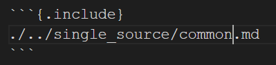

В общем я не думала, что мне опять понадобиться single-source, но ~~жизнь~~ требования технического задания распорядились иначе. 11 комплектов документов с большими общими кусками, кусками, отличающимися только названием ПО - без single source тут с ума сойдешь.

Вот как это работает:

1. Файлы с общими кусками текста лежат где-то в общей папке. В демонстрационном репозитории это `docs_gost/single_source`.
2. В файле или файлах основного документа (например, в `docs_gost/example_doc`) вставляем в нужные места файлы из `docs_gost/single_source` с помощью специального синтаксиса.
3. В шапке документа (в YAML-преамбуле) добавляем свои переменные (например, в `docs_gost/single_source00_begin.md` добавлена переменная `soft-name`).
4. В тексте к переменной обращаемся вот так: `${soft-name}`. При сборке сюда будет подставлено значение переменной из преамбулы.
5. Модифицированная команда pandoc в `build.ps1` применяет все необходимые фильтры и обрабатывает результат. А затем передает уже основному скрипту `build.ps1`, который применяет шаблон и творит свою COMKbject-овскую магию.

В демонстрационном репозитории `example_doc` имеет все перечисленный фичи: переменную, включенные файлы и разнообразные картинки. И да, в файлах-источниках тоже можно использовать переменные, они будут заменены на значение из основного файла.

К счастью, добрые люди уже разработали все необходимые фильтры, так что их осталось просто немного доработать.

Стандартный фильтр из репозитория pandoc [include-files](https://github.com/pandoc/lua-filters/tree/master/include-files) уже делает все, что нужно для счастья. В документе, в который хотим что-то вставить пишем (рисунок [-@fig:2023-03-07-include]):

{#fig:2023-03-07-include}

В команде pandoc нужно передать ключ `-M include-auto` , если нужно автоматически перенумеровывать заголовки. Также можно для каждого блока указывать [свои правила нумерации](https://github.com/pandoc/lua-filters/tree/master/include-files#manual-shifting). Я пока обхожусь `-M include-auto`.

Для переменных тоже уже написано немало фильтров. Я адаптировала вот этот [pandoc-curly-switch](https://github.com/cdivita/pandoc-curly-switch). 

Минусы использования этих фильтров -- не полная совместимость с mkdocs, с которой я пока не разбиралась. В mkdocs тоже есть [переменные](https://jimandreas.github.io/mkdocs-material/reference/variables/) и плагин [include](https://github.com/mondeja/mkdocs-include-markdown-plugin), так что вероятно их можно совместить с pandoc-фильтрами.

Команда pandoc с нашими фильтрами для теста:

```bash
pandoc (cat *.md) -o some.docx -M include-auto --lua-filter include_files.lua --lua-filter linebreaks.lua --lua-filter metadata_processor.lua  --filter pandoc-crossref --citeproc --reference-doc template.docx
```

А вот команда вызова pandoc в скрипте Gostdown. Как видно добавлена переменная `$luafilter`, в которой передается путь к папке с фильтрами `.lua`.

```powershell
&$exe $md -o $tempdocx -M include-auto --lua-filter $luafilter\include_files.lua --lua-filter $luafilter\linebreaks.lua --lua-filter $luafilter\metadata_processor.lua  --filter pandoc-crossref --citeproc --reference-doc $template
```
